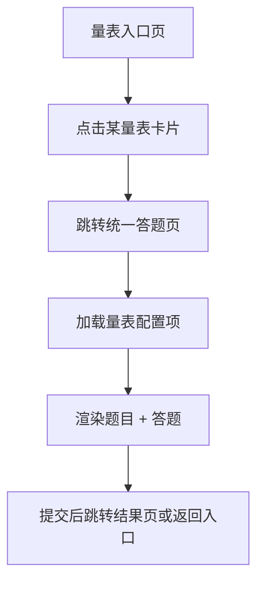

## 📋 配置化量表跳转逻辑（统一入口）

### 核心原则

- 所有量表共用一个答题页面（如 `/pages/assessment.vue`）
- 页面根据传入参数加载对应量表配置（如 JSON 或后端接口）
- 支持自动保存、语音辅助、进度提示、提交跳转等通用交互

---

### 跳转流程图（简化）



---

### 页面跳转参数建议

- 页面路径：`/pages/assessment`
- 路由参数：
  - `scaleId`: 量表唯一标识（如 `PHQ9`, `MMSE`, `ADL`）
  - `mode`: 测试模式（如 `首次测评`, `筛查任务`, `反馈问卷`）
  - `timeSlot`: 时间段（如 `morning`, `evening`，用于筛查任务）
  - `reportTarget`: 是否跳转报告页（如 `true`）

---

### 示例跳转代码（伪代码）

```ts
router.push({
  path: '/pages/assessment',
  query: {
    scaleId: 'PHQ9',
    mode: '筛查任务',
    timeSlot: 'morning',
    reportTarget: true,
  },
})
```

---

### 统一答题页功能清单

| 功能模块     | 描述                                                        |
| ------------ | ----------------------------------------------------------- |
| 动态题目渲染 | 根据 scaleId 加载题目配置，支持单选、多选、打分、填空等题型 |
| 语音辅助     | 每题支持语音朗读，默认开启，用户可关闭                      |
| 进度条       | 显示当前题目进度，适配老年人视觉习惯                        |
| 自动保存     | 每题答完自动保存，防止中途退出丢失                          |
| 提交确认     | 最后一题后弹窗确认提交，防误操作                            |
| 提交跳转     | 提交后根据 mode 跳转至报告页或返回任务页                    |
| 样式适配     | 字体偏大、对比度高、触控区域加大，适配中老年用户            |

---

### 后续建议

- 所有量表配置项建议统一格式（如 JSON Schema），便于维护与扩展
- 支持后端动态下发配置，未来可新增量表无需改动前端结构
- 可加入“答题记录回顾”功能，支持用户查看历史答题内容与报告

---
